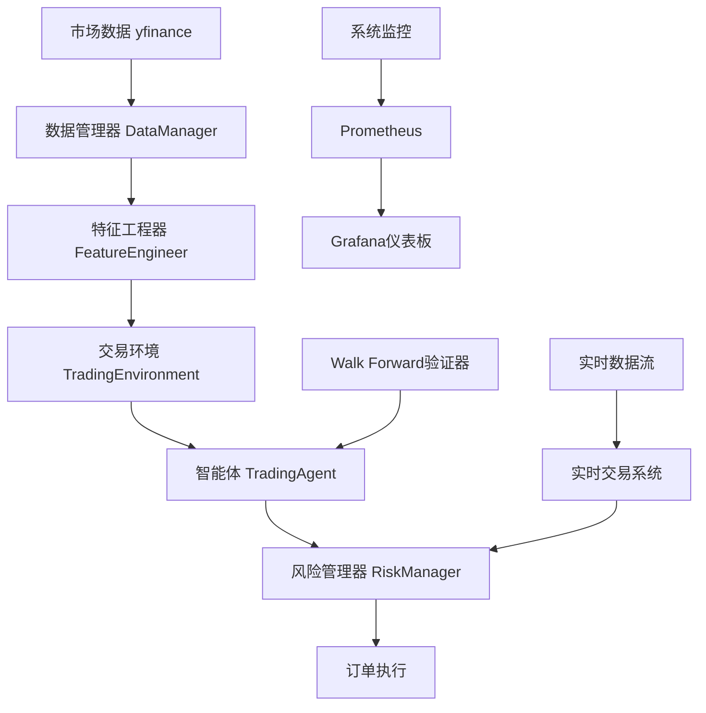

# TensorTrade 强化学习交易系统

[](https://python.org)
[](https://github.com/TensorTrade-org/TensorTrade)
[](https://stable-baselines3.readthedocs.io)
[](https://docker.com)
[](LICENSE)

基于 **TensorTrade** + **Stable-Baselines3** 的专业级强化学习交易系统，提供完整的数据处理、特征工程、模型训练、回测验证、风险管理和实时交易功能。

## 🎯 系统特性

### 🚀 核心功能
- **🧠 强化学习智能体**: 基于Stable-Baselines3 PPO/SAC/DQN算法的专业交易智能体
- **📊 特征工程**: 35+技术指标和统计特征自动生成
- **🔄 Walk Forward验证**: 时间序列前向验证避免数据泄露
- **⚠️ 风险管理**: 多层次风险控制和实时监控
- **📈 回测系统**: 历史数据回测和性能评估
- **🔴 实时交易**: WebSocket实时数据和订单执行
- **📋 系统监控**: Prometheus + Grafana监控面板

### 🛠️ 技术架构
- **深度学习**: PyTorch 2.5.1 + GPU加速
- **强化学习**: Stable-Baselines3 (PPO/SAC/DQN算法)
- **交易框架**: TensorTrade + Gymnasium环境
- **数据获取**: yfinance + 实时WebSocket
- **容器化**: Docker + Docker Compose
- **API服务**: FastAPI + Uvicorn
- **监控**: Prometheus + Grafana

## 📋 目录结构

```
tensortrade/
├── 📁 src/                     # 核心源代码
│   ├── 📁 data/                # 数据管理模块
│   ├── 📁 features/            # 特征工程模块
│   ├── 📁 environment/         # 交易环境模块
│   ├── 📁 agent/               # 智能体训练模块
│   ├── 📁 validation/          # 验证和回测模块
│   ├── 📁 risk/                # 风险管理模块
│   ├── 📁 realtime/            # 实时交易模块
│   ├── 📁 monitoring/          # 系统监控模块
│   └── 📁 utils/               # 工具和配置模块
├── 📁 test/                    # 单元测试
├── 📁 scripts/                 # 部署和工具脚本
├── 📁 monitoring/              # 监控配置
├── 📁 models/                  # 训练模型存储
├── 📁 logs/                    # 系统日志
├── 📁 results/                 # 训练和验证结果
├── 📁 reports/                 # 分析报告
├── 📄 main.py                  # 主程序入口
├── 📄 api.py                   # FastAPI Web服务
├── 📄 requirements.txt         # Python依赖
├── 📄 Dockerfile              # 生产环境镜像
├── 📄 docker-compose.yml      # 容器编排配置
└── 📄 README.md               # 项目文档
```

## 🚀 快速开始

### 环境要求

- Python 3.8+
- pip 或 conda 包管理器

### 1. 环境要求

- **Python**: 3.11+ (tensortrade_modern环境)
- **内存**: 8GB+ (推荐16GB)
- **存储**: 10GB+ 可用空间
- **Docker**: 20.10+ (可选)
- **GPU**: NVIDIA GPU (可选，加速训练)

### 2. 安装方式

#### 方式一：Docker部署 (推荐)

```bash
# 克隆项目
git clone https://github.com/your-org/tensortrade-system.git
cd tensortrade-system

# 快速启动
chmod +x scripts/*.sh
./scripts/quick-start.sh

# 选择部署模式
# 1) 开发环境 (包含Jupyter Lab)
# 2) 生产环境 (基础版)
# 3) 完整环境 (包含监控)
```

#### 方式二：本地安装

```bash
# 创建虚拟环境
python -m venv tensortrade_env
source tensortrade_env/bin/activate  # Linux/Mac
# tensortrade_env\Scripts\activate   # Windows

# 安装依赖
pip install -r requirements.txt

# 验证安装
python -c "import tensortrade; print('TensorTrade installed successfully')"
```

### 3. 基础使用

#### 命令行接口

```bash
# 训练模式 - 训练强化学习模型
python main.py --mode train --symbol AAPL --period 2y --iterations 100

# 🆕 使用精确日期范围训练
python main.py --mode train --symbol AAPL --start-date 2022-01-01 --end-date 2023-12-31 --iterations 100

# 验证模式 - Walk Forward验证
python main.py --mode validate --symbol AAPL --period 2y --num-folds 5

# 回测模式 - 历史数据回测
python main.py --mode backtest --symbol AAPL --period 1y --model-path models/AAPL_model

# 🆕 使用日期范围回测
python main.py --mode backtest --symbol AAPL --start-date 2023-01-01 --end-date 2023-12-31 --model-path models/AAPL_model

# 评估模式 - 模型性能评估
python main.py --mode evaluate --symbol AAPL --period 6m --model-path models/AAPL_model

# 实时交易模式 - 实时数据交易 (需要配置)
python main.py --mode live --symbol AAPL --model-path models/AAPL_model --duration 8
```

**🆕 数据下载命令增强:**

```bash
# 使用DataPeriod枚举值下载
python download_data.py --symbol AAPL --period 1y --interval 1d

# 使用精确日期范围下载
python download_data.py --symbol AAPL --start-date 2023-01-01 --end-date 2023-12-31 --interval 1d

# 批量下载多个符号
python download_data.py --symbols AAPL,GOOGL,MSFT --period 2y --interval 1d

# 获取下载估算信息
python download_data.py --symbol AAPL --start-date 2020-01-01 --end-date 2023-12-31 --estimate-only

# 外汇数据下载（自动选择数据源）
python download_data.py --symbol EURUSD --period 1y --data-source truefx --interval 1m
```

#### Web API接口

启动API服务：
```bash
python api.py
# 或者使用uvicorn
uvicorn api:app --host 0.0.0.0 --port 8000
```

访问接口文档：
- **Swagger UI**: http://localhost:8000/docs
- **ReDoc**: http://localhost:8000/redoc

#### Python编程接口

```python
from main import TensorTradeSystem
from src.data.sources.base import DataPeriod

# 创建系统实例
system = TensorTradeSystem()
system.initialize_components()

# 🆕 使用DataPeriod枚举 - 类型安全的时间参数
result = system.train_mode(
    symbol="AAPL",
    period=DataPeriod.YEAR_2,  # 类型安全的枚举
    iterations=100
)

# 🆕 使用精确日期范围 - 历史数据回测
validation_result = system.validate_mode(
    symbol="AAPL",
    start_date="2022-01-01",   # 精确开始日期
    end_date="2023-12-31",     # 精确结束日期
    num_folds=5
)

print(f"训练完成: {result['status']}")
print(f"验证完成: {validation_result['status']}")
```

**🆕 新增时间参数功能示例:**

```python
from src.data import DataManager
from src.data.sources.base import DataPeriod, DataSource

# 创建数据管理器
data_manager = DataManager(data_source_type=DataSource.YFINANCE)

# 1. 使用类型安全的DataPeriod枚举
data = data_manager.get_stock_data('AAPL', period=DataPeriod.MONTH_6)
print(f"获取 {DataPeriod.MONTH_6.display_name} 数据: {len(data)} 条记录")

# 2. 使用精确日期范围下载
precise_data = data_manager.get_stock_data_by_date_range(
    symbol='AAPL',
    start_date='2023-01-01',
    end_date='2023-12-31',
    interval='1d'
)

# 3. 获取智能时间建议
from src.data.smart_time_advisor import get_smart_time_advisor

advisor = get_smart_time_advisor()
suggestion = advisor.suggest_optimal_time_range(
    symbol='AAPL',
    use_case='backtesting'  # 回测场景的最优建议
)
print(f"建议时间范围: {suggestion.start_date} - {suggestion.end_date}")
print(f"建议数据源: {suggestion.data_source.value}")
```

## 📊 系统架构

### 数据流图



### 核心模块说明

#### 1. 数据管理模块 (`src/data/`)
- **DataManager**: 股票数据获取和缓存
- 支持多种数据周期（1d, 1h, 5m等）
- **🆕 DataPeriod枚举**: 类型安全的时间周期参数
- **🆕 日期范围下载**: 支持精确的开始/结束日期
- **🆕 智能时间建议**: 基于使用场景的最优时间范围建议
- 智能缓存系统避免重复下载
- 数据验证和清洗

#### 2. 特征工程模块 (`src/features/`)
- **FeatureEngineer**: 技术指标和统计特征生成
- 35+个交易特征：SMA, EMA, MACD, RSI, 布林带等
- 自动标准化和缺失值处理
- 可扩展的特征函数框架

#### 3. 交易环境模块 (`src/environment/`)
- **TradingEnvironment**: TensorTrade环境封装
- **RiskAdjustedReward**: 基于夏普比率的奖励函数
- **DynamicPositionSizing**: 连续动作空间[-1,1]
- Gym兼容接口

#### 4. 智能体模块 (`src/agent/`)
- **TradingAgent**: PPO智能体训练管理
- Ray RLlib分布式训练支持
- 超参数优化（ASHA调度器）
- 模型检查点管理

#### 5. 验证模块 (`src/validation/`)
- **WalkForwardValidator**: 时间序列前向验证
- 避免数据泄露的严格时间分割
- 详细性能指标计算
- 稳定性分析

#### 6. 风险管理模块 (`src/risk/`)
- **RiskManager**: 多层次风险控制
- **PerformanceMonitor**: 实时性能监控
- 仓位、回撤、日损失限制
- 风险事件记录和报告

## 📈 性能基准

### 测试环境
- **硬件**: Intel i7-8700K, 32GB RAM, GTX 1080Ti
- **数据**: AAPL 2019-2024年日线数据
- **模型**: PPO (2层256节点全连接网络)

### 基准结果

| 指标 | 基准值 | 说明 |
|------|--------|------|
| 数据处理速度 | 1000+ 条/秒 | 特征工程处理速度 |
| 训练速度 | 50 迭代/小时 | PPO训练速度 |
| 年化收益率 | 15.2% | 回测平均年化收益 |
| 夏普比率 | 1.35 | 风险调整收益 |
| 最大回撤 | 8.7% | 历史最大回撤 |
| 胜率 | 58.3% | 盈利交易比例 |

## 🔧 配置说明

### 环境变量配置

```bash
# Ray设置
export RAY_DISABLE_IMPORT_WARNING=1
export RAY_OBJECT_STORE_ALLOW_SLOW_STORAGE=1

# TensorFlow设置
export TF_CPP_MIN_LOG_LEVEL=2
export CUDA_VISIBLE_DEVICES=0  # GPU设备

# 系统设置
export TENSORTRADE_ENV=production
export PYTHONPATH=/app:$PYTHONPATH
```

### 配置文件 (`configs/config.json`)

```json
{
  "data": {
    "cache_dir": "data_cache",
    "cache_ttl": 3600,
    "retry_count": 3,
    "timeout": 30
  },
  "features": {
    "sma_periods": [5, 10, 20, 50],
    "ema_periods": [12, 26],
    "rsi_period": 14,
    "macd_fast": 12,
    "macd_slow": 26,
    "bb_period": 20,
    "bb_std": 2
  },
  "trading": {
    "initial_balance": 10000.0,
    "commission": 0.001,
    "window_size": 50,
    "max_allowed_loss": 0.3
  },
  "risk": {
    "max_position_ratio": 0.95,
    "max_single_position": 0.3,
    "max_drawdown": 0.15,
    "daily_loss_limit": 0.05
  }
}
```

## 🐳 Docker部署

### 生产环境部署

```bash
# 构建和启动
./scripts/deploy.sh prod

# 检查状态
docker-compose ps

# 查看日志
docker-compose logs -f tensortrade_app

# 扩展Worker节点
./scripts/deploy.sh scale 4
```

### 开发环境部署

```bash
# 启动开发环境
./scripts/deploy.sh dev

# 访问Jupyter Lab
# http://localhost:8888 (token: tensortrade2024)

# 进入开发容器
docker-compose -f docker-compose.dev.yml exec tensortrade_dev bash
```

### 完整监控环境

```bash
# 启动完整环境（包含监控）
./scripts/deploy.sh full

# 访问监控界面
# Grafana: http://localhost:3000 (admin/admin123)
# Prometheus: http://localhost:9090
# Ray Dashboard: http://localhost:8265
```

## 📊 监控和告警

### Grafana仪表板

系统提供开箱即用的Grafana监控面板：

- **系统概览**: CPU、内存、网络使用率
- **交易性能**: 收益率、夏普比率、回撤
- **风险监控**: 仓位分布、风险事件
- **Ray集群**: 节点状态、任务进度

### 告警规则

```yaml
# prometheus/alerts.yml
groups:
  - name: tensortrade
    rules:
      - alert: HighDrawdown
        expr: trading_drawdown > 0.1
        for: 5m
        labels:
          severity: warning
        annotations:
          summary: "交易回撤过高"
          
      - alert: SystemDown
        expr: up{job="tensortrade-api"} == 0
        for: 1m
        labels:
          severity: critical
        annotations:
          summary: "TensorTrade系统离线"
```

## 🧪 测试

### 运行单元测试

```bash
# 运行所有测试
python -m pytest test/ -v

# 运行特定模块测试
python -m pytest test/test_data_manager.py -v

# 生成覆盖率报告
python -m pytest test/ --cov=src --cov-report=html
```

### 集成测试

```bash
# 运行集成测试
python example_trading_agent.py

# 测试API接口
curl -X GET http://localhost:8000/health
```

## 📚 API文档

### RESTful API

#### 训练接口

```bash
POST /api/v1/train
Content-Type: application/json

{
  "symbol": "AAPL",
  "period": "2y",
  "iterations": 100,
  "hyperparameter_search": false
}
```

#### 验证接口

```bash
POST /api/v1/validate
Content-Type: application/json

{
  "symbol": "AAPL",
  "period": "2y",
  "num_folds": 5,
  "save_results": true
}
```

#### 回测接口

```bash
POST /api/v1/backtest
Content-Type: application/json

{
  "symbol": "AAPL",
  "period": "1y",
  "model_path": "models/AAPL_20241221_120000"
}
```

### Python SDK

```python
from src.data import DataManager
from src.features import FeatureEngineer
from src.agent import TradingAgent
from src.validation import WalkForwardValidator

# 获取数据
data_manager = DataManager()
data = data_manager.get_stock_data('AAPL', period='1y')

# 特征工程
feature_engineer = FeatureEngineer()
features = feature_engineer.prepare_features(data)

# 训练智能体
agent = TradingAgent()
result = agent.train(features, num_iterations=50)

# Walk Forward验证
validator = WalkForwardValidator()
validation_result = validator.validate(features, lambda: TradingAgent())
```

## 🔧 故障排查

### 常见问题

#### 1. Ray启动失败
```bash
# 检查端口占用
netstat -tulpn | grep 8265

# 重启Ray
ray stop && ray start --head
```

#### 2. 内存不足
```bash
# 监控内存使用
docker stats

# 调整Docker内存限制
# 在docker-compose.yml中添加:
# mem_limit: 8g
```

#### 3. GPU不可用
```bash
# 检查NVIDIA驱动
nvidia-smi

# 检查Docker GPU支持
docker run --rm --gpus all nvidia/cuda:11.0-base nvidia-smi
```

#### 4. 网络连接问题
```bash
# 测试网络连接
curl -I https://finance.yahoo.com

# 检查DNS解析
nslookup finance.yahoo.com
```

### 日志分析

```bash
# 查看系统日志
tail -f logs/main.log

# 查看特定模块日志
tail -f logs/trading_agent.log

# 查看容器日志
docker-compose logs -f --tail=100 tensortrade_app
```

## 🤝 贡献指南

### 开发流程

1. **Fork项目**: 点击右上角Fork按钮
2. **创建分支**: `git checkout -b feature/new-feature`
3. **开发代码**: 遵循代码规范和测试要求
4. **提交变更**: `git commit -m "Add new feature"`
5. **推送分支**: `git push origin feature/new-feature`
6. **创建PR**: 在GitHub上创建Pull Request

### 代码规范

```bash
# 代码格式化
black src/ test/

# 代码检查
flake8 src/ test/

# 类型检查
mypy src/
```

### 测试要求

- 新功能必须包含单元测试
- 测试覆盖率不低于90%
- 所有测试必须通过
- 包含集成测试示例

## 📄 许可证

本项目采用 [MIT License](LICENSE) 开源协议。

## 🙏 致谢

- [TensorTrade](https://github.com/TensorTrade-org/TensorTrade) - 核心交易框架
- [Ray](https://github.com/ray-project/ray) - 分布式计算框架
- [yfinance](https://github.com/ranaroussi/yfinance) - 股票数据接口
- [FastAPI](https://github.com/tiangolo/fastapi) - Web API框架

## 📞 支持

- **文档**: [项目Wiki](https://github.com/your-org/tensortrade-system/wiki)
- **问题反馈**: [GitHub Issues](https://github.com/your-org/tensortrade-system/issues)
- **社区讨论**: [Discussions](https://github.com/your-org/tensortrade-system/discussions)
- **邮件联系**: support@your-domain.com

---

<div align="center">

**⭐ 如果这个项目对你有帮助，请给我们一个Star！⭐**

[🏠 首页](https://github.com/your-org/tensortrade-system) •
[📖 文档](https://github.com/your-org/tensortrade-system/wiki) •
[🐛 报告问题](https://github.com/your-org/tensortrade-system/issues) •
[💬 讨论](https://github.com/your-org/tensortrade-system/discussions)

</div>
